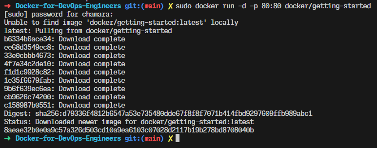
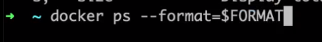

# Docker-for-DevOps-Engineers

- [Docker-for-DevOps-Engineers](#docker-for-devops-engineers)
  - [1.What is Docker](#1what-is-docker)
  - [2.Docker vs VM](#2docker-vs-vm)
  - [3.Installing Docker](#3installing-docker)
  - [4.Exploring Docker Dashboard](#4exploring-docker-dashboard)
  - [5.Tools](#5tools)
  - [6.Getting started with Docker](#6getting-started-with-docker)
  - [7.Undestanding Containers](#7undestanding-containers)
  - [8.Docker Images and Containers](#8docker-images-and-containers)
  - [9.Managing Containers](#9managing-containers)
  - [10.Docker ps format](#10docker-ps-format)
  - [11.Exposing Ports](#11exposing-ports)
  - [12.Exposing Multiple Ports](#12exposing-multiple-ports)
  - [13.Naming Containers](#13naming-containers)
  - [14.Running Container in the background](#14running-container-in-the-background)
  - [15.Docker Images](#15docker-images)
  - [16.Managing Docker Images](#16managing-docker-images)
  - [17.Docker Pull](#17docker-pull)
  - [18.Inspecting Images](#18inspecting-images)
  - [19.Docker Architecture](#19docker-architecture)
  - [20.Docker Daemon](#20docker-daemon)
  - [21.Volumes](#21volumes)
  - [22.Bind Mount Volumes](#22bind-mount-volumes)
  - [23.Bind Mount Volumes in Action](#23bind-mount-volumes-in-action)
  - [24.Using Vomules for Local Dev](#24using-vomules-for-local-dev)
  - [25.Docker Volumes](#25docker-volumes)
  - [26.TMPFS Mount](#26tmpfs-mount)
  - [27.Dockerfile](#27dockerfile)
  - [28.Creating Dockerfile](#28creating-dockerfile)
  - [29.Building DockerImages](#29building-dockerimages)
  - [30.Running a container from Custom Image](#30running-a-container-from-custom-image)
  - [31.Investigate Container file system](#31investigate-container-file-system)
  - [32.Buliding ExpressJS API](#32buliding-expressjs-api)
  - [33.Dockerfile and Building image for user-api](#33dockerfile-and-building-image-for-user-api)
  - [34.Running Container for user-api image](#34running-container-for-user-api-image)
  - [35.Exploring Dockerfiles](#35exploring-dockerfiles)
  - [36.Dockerfile reference](#36dockerfile-reference)
  - [37.Pulling Images using a Specifc Tag](#37pulling-images-using-a-specifc-tag)
  - [38.Creating tags](#38creating-tags)
  - [39.Creating Version 2 of the Dashboard](#39creating-version-2-of-the-dashboard)
  - [40.Never Run Latest In Production](#40never-run-latest-in-production)
  - [41.Image Variants](#41image-variants)
  - [42.Docker Registries](#42docker-registries)
  - [43.Docker Login](#43docker-login)
  - [44.Docker push](#44docker-push)
  - [45.Docker Inpect](#45docker-inpect)
  - [46.Logs](#46logs)
  - [47.Running commands in Containers](#47running-commands-in-containers)
  - [48.How to comunicate between containers](#48how-to-comunicate-between-containers)
  - [49.Docker Network](#49docker-network)
  - [50.MongoDB Container](#50mongodb-container)
  - [51.MongoExpress](#51mongoexpress)
  - [52.Understanding Container Communication](#52understanding-container-communication)
  - [53.Another example](#53another-example)
  - [54.What is Docker Compose](#54what-is-docker-compose)
  - [55.Docker Compose cmd](#55docker-compose-cmd)
  - [56.Services](#56services)
  - [57.Docker Network](#57docker-network)
  - [58.Docker Compose Up](#58docker-compose-up)
  - [59.Exploring docker compose commands](#59exploring-docker-compose-commands)
  - [60.Docker Volume](#60docker-volume)
  - [61.Docker Compose Documentation](#61docker-compose-documentation)
  - [62.Docker scan](#62docker-scan)
  - [63.Trivy](#63trivy)
  - [64.Distroless Images](#64distroless-images)
  - [65.Security Best Practices](#65security-best-practices)


## 1.What is Docker


what is docker ?

Docker is a tool designed to make it easier to create, deploy, and run applications by using containers. Containers allow a developer to package up an application with all of the parts it needs, such as libraries and other dependencies, and deploy it as one package.

## 2.Docker vs VM


## 3.Installing Docker

docker desktop for windows link : https://docs.docker.com/docker-for-windows/install/

## 4.Exploring Docker Dashboard


## 5.Tools

we need to install git bash and visual studio code

## 6.Getting started with Docker

```bash
docker -v

```


to see all the available commands





http://localhost/tutorial/


```bash
# This code is used to stop and remove a docker container. The docker container is identified by its container ID, which is passed in through the args array. The container is stopped first, then removed.

➜  ~ docker container stop 8aeae32b0e0a
8aeae32b0e0a
➜  ~ docker rm 8aeae32b0e0a
8aeae32b0e0a

```

```bash
# Pull the latest image from Docker Hub
sudo docker pull amigoscode/2048

# Run the image on port 80
# -d means run in detached mode
# -p means map port 80 on the host to port 80 on the container
sudo docker run -d -p 80:80 amigoscode/2048
```
http://localhost:80


now we can see the running containers


## 7.Undestanding Containers


```bash
➜  ~ docker container ls --help

Usage:  docker container ls [OPTIONS]

List containers

Aliases:
  docker container ls, docker container list, docker container ps, docker ps

Options:
  -a, --all             Show all containers (default shows just running)
  -f, --filter filter   Filter output based on conditions provided
      --format string   Format output using a custom template:
                        'table':            Print output in table format with column headers (default)
                        'table TEMPLATE':   Print output in table format using the given Go template
                        'json':             Print in JSON format
                        'TEMPLATE':         Print output using the given Go template.
                        Refer to https://docs.docker.com/go/formatting/ for more information about formatting output with templates
  -n, --last int        Show n last created containers (includes all states) (default -1)
  -l, --latest          Show the latest created container (includes all states)
      --no-trunc        Don't truncate output
  -q, --quiet           Only display container IDs
  -s, --size            Display total file sizes
```


```bash
➜  ~ docker container ls
CONTAINER ID   IMAGE             COMMAND                  CREATED             STATUS          PORTS                NAMES
f4783336d1d3   amigoscode/2048   "/docker-entrypoint.…"   About an hour ago   Up 25 seconds   0.0.0.0:80->80/tcp   zealous_vaughan
```
```bash
➜  ~ docker exec --help

Usage:  docker exec [OPTIONS] CONTAINER COMMAND [ARG...]

Execute a command in a running container

Aliases:
  docker container exec, docker exec

Options:
  -d, --detach               Detached mode: run command in the background
      --detach-keys string   Override the key sequence for detaching a container
  -e, --env list             Set environment variables
      --env-file list        Read in a file of environment variables
  -i, --interactive          Keep STDIN open even if not attached
      --privileged           Give extended privileges to the command
  -t, --tty                  Allocate a pseudo-TTY
  -u, --user string          Username or UID (format: "<name|uid>[:<group|gid>]")
  -w, --workdir string       Working directory inside the container
➜  ~
``` 

```bash
docker exec -i -t f4783336d1d3 sh
# ls
bin  boot  dev  docker-entrypoint.d  docker-entrypoint.sh  etc  home  lib  lib64  media  mnt  opt  proc  root  run  sbin  srv  sys  tmp  usr  var
#
```
as you can see we are inside the container

and this is a linux file structure.

so if we go to the binary folder we can see all the binaries that are installed in the container

```bash
# cd bin
# ls
bash   cp    dir            egrep    gunzip    login  mktemp      nisdomainname  rm         sleep  tempfile  uncompress    zcat    zforce
cat    dash  dmesg          false    gzexe     ls     more        pidof          rmdir      stty   touch     vdir          zcmp    zgrep
chgrp  date  dnsdomainname  fgrep    gzip      lsblk  mount       pwd            run-parts  su     true      wdctl         zdiff   zless
chmod  dd    domainname     findmnt  hostname  mkdir  mountpoint  rbash          sed        sync   umount    which         zegrep  zmore
chown  df    echo           grep     ln        mknod  mv          readlink       sh         tar    uname     ypdomainname  zfgrep  znew
#
```
app files
```bash
# cd /usr/share/nginx/html
# ls
50x.html  CONTRIBUTING.md  Dockerfile  LICENSE.txt  README.md  Rakefile  favicon.ico  index.html  js  meta  style
#
```


## 8.Docker Images and Containers


from one docker image we can create multiple containers.

```bash
docker container run -d -p 8080:80 amigoscode/2048
```
`amigoscode/2048` this is the image name

`-d` run in detached mode

`-p` map port 8080 on the host to port 80 on the container

`8080:80` this is the port mapping


```bash
➜  ~ docker container run -d -p 8080:80 nginx
Unable to find image 'nginx:latest' locally
latest: Pulling from library/nginx
9a59d19f9c5b: Download complete
9ea27b074f71: Download complete
c6edf33e2524: Download complete
84b1ff10387b: Download complete
9b16c94bb686: Download complete
517357831967: Download complete
Digest: sha256:10d1f5b58f74683ad34eb29287e07dab1e90f10af243f151bb50aa5dbb4d62ee
Status: Downloaded newer image for nginx:latest
4cead163c96459f132b0a735781b4df5fd445568c69052aa6171ab37c1316273
➜  ~ docker container ls
CONTAINER ID   IMAGE     COMMAND                  CREATED          STATUS          PORTS                  NAMES
4cead163c964   nginx     "/docker-entrypoint.…"   13 seconds ago   Up 11 seconds   0.0.0.0:8080->80/tcp   objective_mirzakhani
```

http://localhost:8080/


https://hub.docker.com/


## 9.Managing Containers
```bash
# to see all the containers
docker container ls -a

CONTAINER ID   IMAGE     COMMAND                  CREATED          STATUS                      PORTS     NAMES
4cead163c964   nginx     "/docker-entrypoint.…"   24 minutes ago   Exited (0) 10 minutes ago             objective_mirzakhani

# to see all the containers with their ids
# -q is for quiet mode
docker container ls -aq

4cead163c964

# to stop a container
docker container stop 4cead163c964

# to remove a stopped container
docker container rm 4cead163c964

# to remove a running container
# -f is for force
docker container rm -f 4cead163c964

# to remove all the containers
docker container rm $(docker container ls -aq)

# to start a container
docker container start 4cead163c964
```

## 10.Docker ps format
```bash
➜  Docker-for-DevOps-Engineers git:(main) ✗ docker ps --help 

Usage:  docker ps [OPTIONS]

List containers

Aliases:
  docker container ls, docker container list, docker container ps, docker ps

Options:
  -a, --all             Show all containers (default shows just running)
  -f, --filter filter   Filter output based on conditions provided
      --format string   Format output using a custom template:
                        'table':            Print output in table format with column headers (default)
                        'table TEMPLATE':   Print output in table format using the given Go template
                        'json':             Print in JSON format
                        'TEMPLATE':         Print output using the given Go template.
                        Refer to https://docs.docker.com/go/formatting/ for more information about formatting output with templates
  -n, --last int        Show n last created containers (includes all states) (default -1)
  -l, --latest          Show the latest created container (includes all states)
      --no-trunc        Don't truncate output
  -q, --quiet           Only display container IDs
  -s, --size            Display total file sizes
```





## 11.Exposing Ports


```bash
➜  ~ docker container ls -a
CONTAINER ID   IMAGE     COMMAND   CREATED   STATUS    PORTS     NAMES
➜  ~ docker container run -d -p 8080:80 nginx
f9113d5596825550a954814f9a1853b0249fe7bf5ebb8adf34ec7e2e2a340156
➜  ~ docker container run -d -p 8081:80 nginx
8b680f1418cf7257e44cf9b29e252801d60c4807b51efecf76ce1403a84d6442
➜  ~ docker container ls
CONTAINER ID   IMAGE     COMMAND                  CREATED              STATUS              PORTS                  NAMES
8b680f1418cf   nginx     "/docker-entrypoint.…"   About a minute ago   Up About a minute   0.0.0.0:8081->80/tcp   crazy_moore
f9113d559682   nginx     "/docker-entrypoint.…"   About a minute ago   Up About a minute   0.0.0.0:8080->80/tcp   nervous_burnell
➜  ~ docker container run --help

Usage:  docker container run [OPTIONS] IMAGE [COMMAND] [ARG...]

Create and run a new container from an image

Aliases:
  docker container run, docker run

Options:
 -p, --publish list                   Publish a container's port(s) to the host
  -P, --publish-all                    Publish all exposed ports to random ports
      --pull string                    Pull image before running ("always", "missing", "never") (default "missing")
```

## 12.Exposing Multiple Ports
```bash
➜  ~ docker container run -d -p 8081:80 -p 8080:80 -p 2000:80 nginx
62d098bc136f07aeb264e39fa91ff4b2c1ba18e302b7abd7819956727685ead9
➜  ~ docker container ls
CONTAINER ID   IMAGE     COMMAND                  CREATED         STATUS         PORTS                                                              NAMES
62d098bc136f   nginx     "/docker-entrypoint.…"   5 seconds ago   Up 5 seconds   0.0.0.0:2000->80/tcp, 0.0.0.0:8080->80/tcp, 0.0.0.0:8081->80/tcp   jolly_panini
```


if the port is already allocated we will get this error.

```bash
➜  ~ docker container run -d -p 8081:80 -p 8080:80 -p 2000:80 nginx
a2847fa225f8da322f5d615d4901f896b1f6e0d6f0dbbefec614c16f967fbf74
docker: Error response from daemon: driver failed programming external connectivity on endpoint eager_faraday (5874a3000d0436a916b9c53b8f0b4ab7565b1aa257327d51a2bedf7f619b26b0): Bind for 0.0.0.0:2000 failed: port is already allocated.
➜  ~
```


## 13.Naming Containers
```bash

```

```bash

```
## 14.Running Container in the background
```bash

```

```bash

```
## 15.Docker Images
```bash

```

```bash

```
## 16.Managing Docker Images
```bash

```

```bash

```
## 17.Docker Pull
```bash

```

```bash

```
## 18.Inspecting Images
```bash

```

```bash

```
## 19.Docker Architecture
```bash

```

```bash

```
## 20.Docker Daemon
```bash

```

```bash

```
## 21.Volumes
```bash

```

```bash

```
## 22.Bind Mount Volumes
```bash

```

```bash

```
## 23.Bind Mount Volumes in Action
```bash

```

```bash

```
## 24.Using Vomules for Local Dev
```bash

```

```bash

```
## 25.Docker Volumes
```bash

```

```bash

```
## 26.TMPFS Mount
```bash

```

```bash

```
## 27.Dockerfile
```bash

```

```bash

```
## 28.Creating Dockerfile
```bash

```

```bash

```
## 29.Building DockerImages
```bash

```

```bash

```
## 30.Running a container from Custom Image
```bash

```

```bash

```
## 31.Investigate Container file system
```bash

```

```bash

```
## 32.Buliding ExpressJS API
```bash

```

```bash

```
## 33.Dockerfile and Building image for user-api
```bash

```

```bash

```
## 34.Running Container for user-api image
```bash

```

```bash

```
## 35.Exploring Dockerfiles
```bash

```

```bash

```
## 36.Dockerfile reference
```bash

```

```bash

```
## 37.Pulling Images using a Specifc Tag
```bash

```

```bash

```
## 38.Creating tags
```bash

```

```bash

```
## 39.Creating Version 2 of the Dashboard
```bash

```

```bash

```
## 40.Never Run Latest In Production
```bash

```

```bash

```
## 41.Image Variants
```bash

```

```bash

```
## 42.Docker Registries
```bash

```

```bash

```
## 43.Docker Login
```bash

```

```bash

```
## 44.Docker push
```bash

```

```bash

```
## 45.Docker Inpect
```bash

```

```bash

```
## 46.Logs
```bash

```

```bash

```
## 47.Running commands in Containers
```bash

```

```bash

```
## 48.How to comunicate between containers
```bash

```

```bash

```
## 49.Docker Network
```bash

```

```bash

```
## 50.MongoDB Container
```bash

```

```bash

```
## 51.MongoExpress
```bash

```

```bash

```
## 52.Understanding Container Communication
```bash

```

```bash

```
## 53.Another example
```bash

```

```bash

```
## 54.What is Docker Compose
```bash

```

```bash

```
## 55.Docker Compose cmd
```bash

```

```bash

```
## 56.Services
```bash

```

```bash

```
## 57.Docker Network
```bash

```

```bash

```
## 58.Docker Compose Up
```bash

```

```bash

```
## 59.Exploring docker compose commands
```bash

```

```bash

```
## 60.Docker Volume
```bash

```

```bash

```
## 61.Docker Compose Documentation
```bash

```

```bash

```
## 62.Docker scan
```bash

```

```bash

```
## 63.Trivy
```bash

```

```bash

```
## 64.Distroless Images
```bash

```

```bash

```
## 65.Security Best Practices
```bash

```

```bash

```


